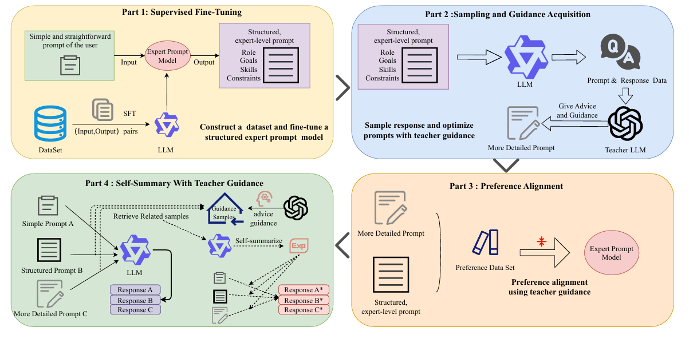
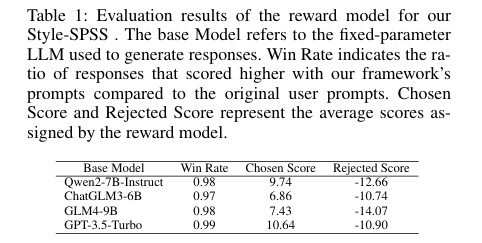
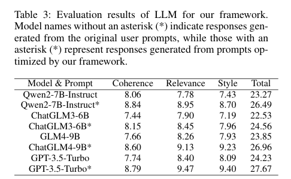

# Style-SPSS
# The pipeline of Style-SPSS:

# Project Structure
- `data/`: The datasets we used.
- `Style-SPSS/`: Source codes.
  - `prompts.py`: The prompts used in our framework.

# dataset
The datasets used in Style-SPSS is in `data/`, including **SFT_prompt_data**, **DPO_prompt_data**, **self_summary**, and **reward_model_train**, for different steps of our framework.    
**SFT_prompt_data** is used to supervised fine tune the expert prompt model.  
**DPO_prompt_data** is used to preference algin the expert prompt model.  
**self_summary** is the base LLM's self_summary repository.  
**reward_model_train** is the preference response data to train a model to evaluate the quality of the response from different prompts.  
The 'test_final_6ans.json' shows  the comparison of our test questions under different strategies at various stages of prompt framework optimization.

## How to use
Our framework is designed to optimize prompts to get stylized response and can be used by attaching it to the base large model without requiring any additional operations.

# Experiment:
RM evaluation：  
  

LLM evaluation：  

human evaluation：  

## Acknowledgements
This project uses code from the following repositories:
- [LLaMA-Factory](https://github.com/hiyouga/LLaMA-Factory) -  We used the implementation of the SFT , DPO and RM algorithm from this repository.

We would like to thank the authors for their valuable contributions to the open-source community.
